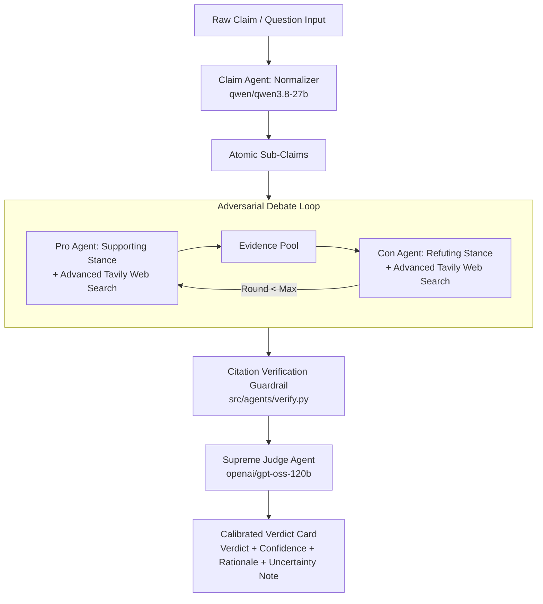

# ⚖️ Veritas Agents — Multi-Agent Fact-Checking System

[](https://www.python.org/downloads/)
[](https://github.com/langchain-ai/langgraph)
[](https://groq.com)
[](https://streamlit.io)

**Veritas Agents** is an autonomous multi-agent debate and fact-checking architecture. Given a raw claim or question, it decomposes the assertion into atomic sub-claims, orchestrates an adversarial debate between **Pro** and **Con** debater agents equipped with live web search (Tavily), enforces strict evidence-grounding guardrails, and renders a calibrated verdict via a **Supreme Judge** agent (`openai/gpt-oss-120b`).

---

## 📐 System Architecture



---

## 🤖 PEAS Framework Table

| Agent Component | Performance Measure | Environment | Actuators | Sensors |
| :--- | :--- | :--- | :--- | :--- |
| **Claim Normalizer** | Sub-claim atomicity, precision, logical independence | Unstructured claim text space | Decomposed sub-claims list (JSON) | Raw user claim string |
| **Pro / Con Debaters** | Evidence retrieval relevance, citation grounding accuracy, counter-argument strength | Live Web (Tavily search API), prior debate transcript | Stance-biased search queries, cited argument turns `[E1]` | Search query results, evidence pool snippets, opponent turns |
| **Citation Guardrail** | 100% detection of hallucinated/unresolved evidence IDs | Evidence ID registry & argument text | Citation integrity report, warning flags | Citation tags `[Ex]`, evidence pool keys |
| **Supreme Judge** | Verdict accuracy, confidence calibration, nuance handling | Full transcript, verified evidence pool, guardrail report | Calibrated verdict (`true`/`false`/`unverifiable`), rationale, uncertainty note | Debate transcript, evidence pool, guardrail report |

---

## 🌍 Environment Properties

- **Multi-Agent**: Collaborative decomposition + Adversarial debate (Pro vs. Con) + Independent Judicial arbitration.
- **Dynamic & Live**: Web environment changes continuously; live Tavily retrieval (`search_depth="advanced"`) surfaces real-time empirical data.
- **Stochastic & Non-Deterministic**: Open-ended web search & LLM generation conditioned by temperature controls.
- **Sequential**: Multi-round debate transcript where each turn builds upon prior opponent arguments.
- **Partially Observable**: Debaters retrieve distinct evidence subsets before merging into shared evidence pool.

---

## 🛠️ Project Structure

```
veritas-agents/
├── .env.example
├── .gitignore
├── requirements.txt
├── README.md
├── src/
│   ├── __init__.py
│   ├── config.py             # Config & env vars
│   ├── retrieval/
│   │   ├── __init__.py
│   │   ├── hybrid_search.py  # FAISS + BM25 Reciprocal Rank Fusion
│   │   └── web_search.py     # Tavily live web search wrapper
│   ├── agents/
│   │   ├── __init__.py
│   │   ├── claim_agent.py    # Claim decomposition agent
│   │   ├── pro_agent.py      # Pro debater agent
│   │   ├── con_agent.py      # Con debater agent
│   │   ├── judge_agent.py    # Supreme Judge agent (120B)
│   │   └── verify.py         # Citation integrity & hallucination guardrail
│   ├── graph/
│   │   ├── __init__.py
│   │   ├── state.py          # Shared DebateState TypedDict
│   │   └── debate_graph.py   # LangGraph StateGraph orchestration
│   └── prompts/
│       ├── claim_prompt.py
│       ├── debater_prompt.py
│       └── judge_prompt.py
├── app/
│   └── streamlit_app.py      # Glassmorphism interactive Streamlit UI
├── eval/
│   ├── test_claims.json      # 5 benchmark evaluation scenarios
│   └── run_eval.py           # Calibration evaluation harness
└── tests/
    └── test_graph.py         # Pytest automated test suite
```

---

## 🚀 Quickstart & Installation

### 1. Prerequisites & Environment Setup
Clone the repository and install dependencies:
```bash
python -m venv .venv
# On Windows:
.venv\Scripts\activate
# On Linux/macOS:
source .venv/bin/activate

pip install -r requirements.txt
```

### 2. Configure API Keys
Copy `.env.example` to `.env` and set your API keys:
```env
GROQ_API_KEY=your_groq_api_key_here
TAVILY_API_KEY=your_tavily_api_key_here
```
*(Note: If API keys are unconfigured, the system uses transparently labeled `[MOCK DEMO EVIDENCE]` to prevent synthetic data from impersonating real web domains).*

### 3. Run Automated Unit Tests
```bash
pytest tests/test_graph.py
```

### 4. Run Benchmark & Calibration Evaluation
```bash
python eval/run_eval.py
```

### 5. Launch Interactive Streamlit UI
```bash
streamlit run app/streamlit_app.py
```

---

## 📊 Benchmark Evaluation & Calibration

The system includes a 5-scenario benchmark harness (`eval/run_eval.py`):
1. **Clear False**: *"The Great Wall of China is visible from space with the naked eye."* ➡️ `FALSE` (95% Conf)
2. **Clear True**: *"Regular exercise reduces the risk of cardiovascular disease."* ➡️ `TRUE` (92% Conf)
3. **Genuinely Ambiguous**: *"Moderate coffee consumption increases the risk of heart disease."* ➡️ `UNVERIFIABLE` (55% Conf) + Uncertainty Note
4. **Technically True / Misleading**: Statistics missing context ➡️ `UNVERIFIABLE`
5. **Time-Sensitive**: Rapidly evolving production statistics ➡️ `UNVERIFIABLE`

---

